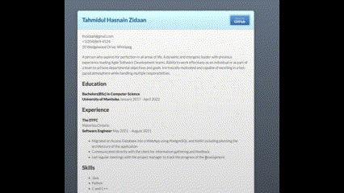

# Hosting a Markdown-formatted Resume

**Purpose:** A step-by-step guide on using Markdown, GitHub Pages, and Jekyll to host a résumé on a static website using the concepts as described in Andrew Etter's book *Modern Technical Writing*.

## Summary
- [Prerequisites](#prerequisites)
- [Instructions](#instructions)
- [More Resources](#more-resources)
- [Authors and Acknowledgements](#authors-and-acknowledgments)
- [FAQ](#faq)


## Prerequisites

### Markdown-Formatted Resume
Markdown is a simple markup language that can be used in a plain text editor to create styled content.John Gruber and Aaron Swartz created Markdown in 2004 as a markup language with the goal of allowing anyone to write in an easy-to-read and easy-to-write plain text format. 

##### Why Markdown? 
>As per Etter's book *Modern Technical Writing*, the use of Lightweight Markup language can be useful and simple while creating a website.It makes use of simple syntax and has a minimal learning curve.It also allows you to update the file using a regular text editor.


### GitHub Account
An account to host your resume is required.
**Note -** When hosting markdown files on GitHub Pages, it's important to use [GitHub Flavored Markdown](https://guides.github.com/features/mastering-markdown/).  

### Jekyll
Use Jekyll to easily customize your website. Multiple themes are available for you to choose from or you can simply add a `_config.yml` file in your repository containing a simple jekyll theme.

In `_config.yml` 
```
theme: jekyll-theme-modernist
```


## Instructions

### 1. Resume 
Markdown is the most widely used lightweight markup language in the world, and there are a number of software tools that may help you get the most out of it, including: 

>* [MarkdownPad](http://markdownpad.com/) (Windows)
>* [iA Writer](https://ia.net/writer) (Mac OS)
>* [ReText](https://codepre.com/how-to-install-retext-restructuredtext-editor-in-ubuntu-a-markdown-editor-for-linux.html) (Linux)  

**Notes** 
* Please use GitHub-flavored Markdown if you decide to host your resume on GitHub.
* Save your resume file as `index.md`

### 2. GitHub Account 
>Etter promotes the use of distributed version control systems (DVCS) like Git and Mercurial over centralised systems in his book *Modern Technical Writing*. Offline work is allowed with these systems, and overall performance is better. It's also a technology that most developers use, so having all of your work, including documentation, in one place is an advantage.

#### Create an Account 
1. Visit [GitHub](https://github.com/)
2. Enter your email and click Sign Up
3. Use the prompts as guide to finish creating your account

#### Create a New Repository 
1. Login to your [GitHub](https://github.com/) account
2. Click on Repositories 
3. Click New Button - **Green Button on the top right of the screen**
4. Name you repository in the following format - YourUserName.github.io
5. Click on Create repository - **Bottom of the screen**

#### Upload your Resume in the repository
1. Click on Add File
2. Click Upload Files
3. Select your resume and make sure the file name is `index.md`


### 3. Host your Resume using GitHub Pages
>Static websites are excellent for documentation since they have no dependencies and are easy to deploy, according to Etter in his book *Modern Techinal Writing*. GitHub Pages uses Jekyll to host static sites and even allows you to apply styles to your documentation, known as themes, to make it appear more professional and consistent. 

1. Go to your repository and click on Settings
2. Find the **Pages** section from the sidebar
3. Make sure that the 'main' branch is chosen as source and **Save**
4. Use the Theme Chooser to choose any theme for your resume

### Conclusion 
Congrats!! If you've followed the steps in this tutorial, you should have a simple-to-update résumé that's been uploaded to GitHub and is available for everyone to view. Feel free to contact [me](https://www.linkedin.com/in/tahmidul-hasnain-zidaan-2b973b200/) if you have questions about anything regarding the content. 

This is how your resume might look when you visit *YourUserName*.github.io <br/>



### More Resources
* [MarkDown Tutorial](https://www.markdowntutorial.com/)  
* [Modern Technical Writing](https://www.amazon.ca/Modern-Technical-Writing-Introduction-Documentation-ebook/dp/B01A2QL9SS) by Andrew Etter  
* [GitHub Pages](https://pages.github.com/)


## Authors and Acknowledgments
This document was written by Tahmidul Hasnain Zidaan, using Andrew Etter's book *Modern Technical Writing* as reference. <br />
Special thanks to my peers: <br/>
[Scott Jodoin](https://github.com/scottjodoin) <br/>
[Kyle Calinisan](https://github.com/kyl-dc) <br/>
[Raven Mico Carencia](https://github.com/Leiven) <br/>
[Hao Qin](https://github.com/qinh3uofm) <br/>

## FAQ

**Why is my resume not showing up?**  
> Make sure the file containing your Resume is written in GitHub-Flavored Markdown or GitHub may have trouble rendering the content.

**Why is Markdown better than a Word processor?**
> Markdown allows you to separate the content from style.Using this, you can have consistency in your content and style without having worry about style while writing.  


**Is GitHub necessary to host my resume?**
>No, a static site can be manually hosted by using a lightweight markup and a theme to a generator like Jekyll or Sphinx.By editing the text and reprocessing everything, the site can be updated. 
